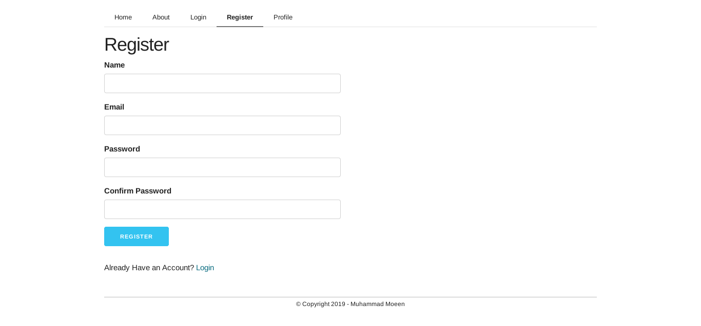

# Flask Blog
A Monolithic Blogging Web Application created using following technologies
* Python Flask for Backend - [Link](https://www.fullstackpython.com/flask.html)
* Skeleton Extended CSS for Frontend - [Link](https://github.com/moeenn/skeleton-extended)

## Dependencies
* Flask - Python Web-development Microframework - [Link](https://pypi.org/project/Flask/)
* Flask-SQLAlchemy - SQL Object Relational Mapper (ORM) - [Link](https://pypi.org/project/Flask-SQLAlchemy/)
* Flask-WTF - WT Forms for User inputs and Validations - [Link](https://pypi.org/project/Flask-WTF/)
* Flask-Bcrypt - Hash Generation - [Link](https://pypi.org/project/Flask-Bcrypt/)
* Flask-Login - Session Manager - [Link](https://pypi.org/project/Flask-Login/)
* Pillow - Image Manipulation - [Link](https://pypi.org/project/Pillow/)

## Credit
Special Thanks to Corey Schafer who is the Best Programming Teacher that I've ever had. Check him out
* Website - [Link](https://coreyms.com/)
* YouTube - [Link](https://www.youtube.com/user/schafer5)

## Screenshots
#### Home Page

#### About

#### Login

#### Register Account

#### Password Recovery

#### Form Validations

#### Profile Page

#### Article Page

